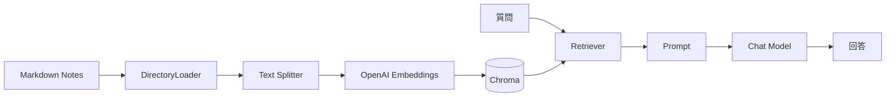
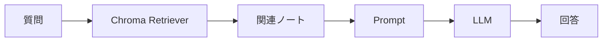
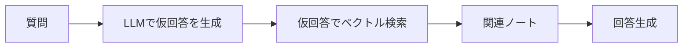
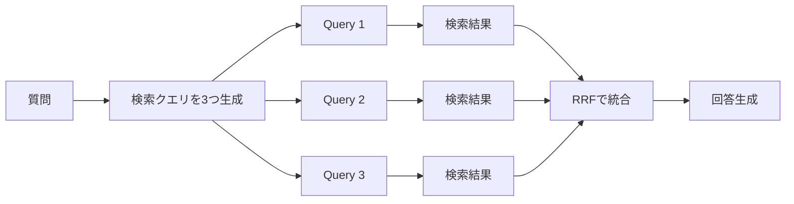
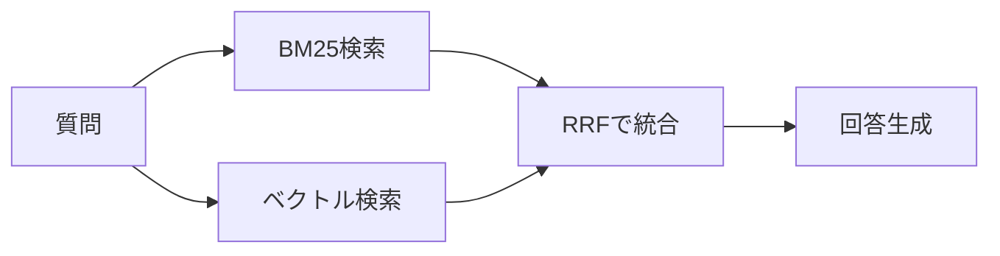
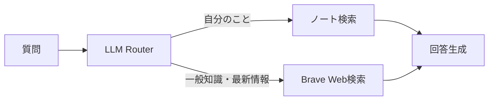
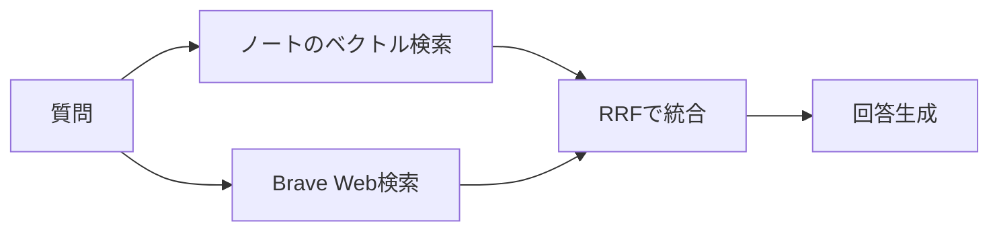

# LangChain RAG Notes

LangChainでローカルMarkdownノートを検索するRAG実装集です。

最初はシンプルなRAGから始めて、HyDE、Multi Query、RRF、BM25、Web検索との組み合わせまで段階的に試せます。

## 全体像



基本は、ローカルのMarkdownノートをチャンク化してChromaに入れ、質問に近いチャンクを検索してLLMに渡す流れです。

## セットアップ

```bash
uv sync
export OPENAI_API_KEY="..."
```

任意で利用するモデルを変更できます。

```bash
export OPENAI_CHAT_MODEL="gpt-4o-mini"
export OPENAI_EMBEDDING_MODEL="text-embedding-3-small"
```

Web検索を使う例では Brave Search API キーも必要です。

```bash
export BRAVE_SEARCH_API_KEY="..."
```

## pi スキルとして使う

このリポジトリには `skills/rag-notes/SKILL.md` があります。pi-agent に認識させるには、`rag install-skill` を使うか、手動で配置してください。

### rag install-skill で自動配置（推奨）

```bash
rag install-skill --link        # シンボリックリンクで配置
rag install-skill               # コピーで配置
rag install-skill --force       # 上書き更新
```

`--link` を使うと、リポジトリ内のスキルファイルを更新した際に pi-agent も自動で最新になります。

### 手動で配置する場合

```bash
# シンボリックリンクで管理
ln -s /path/to/this/repo/skills/rag-notes ~/.pi/agent/skills/rag-notes

# またはコピー
cp -r /path/to/this/repo/skills/rag-notes ~/.pi/agent/skills/
```

これで pi は「自分のノートを探して」「過去の学びを教えて」と言われた時に、自動で `rag` コマンドを使うようになります。

## CLI コマンド `rag`

全ての戦略を統一した CLI コマンド `rag` が使えます。任意のディレクトリから実行できます。

### インストール

```bash
# 1. リポジトリをクローン（または任意の場所に置く）
git clone https://github.com/soramameen/langchain-rag-notes.git
cd langchain-rag-notes

# 2. グローバルにインストール
uv tool install .

# pip の場合
pip install -e .
```

`~/.local/bin/rag` にエントリポイントが作成されます。`~/.local/bin` が PATH に含まれていることを確認してください。

アンインストールは `uv tool uninstall langchain-practice` または `pip uninstall langchain-practice` です。

### 初期設定

対話式で検索対象ディレクトリとデフォルト strategy を登録します。設定は `~/.config/rag/config.json` に保存されます。

```bash
rag init
```

### 質問する

```bash
# 設定済みのノートディレクトリに対して質問（最もシンプル）
rag "私の学びを教えて"

# strategy を切り替え
rag "私の学びを教えて" --strategy hyde
rag "私の学びを教えて" --strategy multi-query

# 一時的にディレクトリを指定（config の設定を上書き）
rag "最近の関心を教えて" --notes-dir ~/notes1 --notes-dir ~/notes2

# agent-notes（AI生成・構造化ノート）も一緒に検索
rag "最近の関心を教えて" \
  --notes-dir ~/notes \
  --agent-notes-dir ~/agent-notes
```

`--notes-dir` は自分の言葉で書いたノート、`--agent-notes-dir` はAI生成や構造化されたノートに使います。検索結果では `source_type` として区別され、LLMに渡る文脈にも「自分の言葉のノート」か「AI生成ノート」かが明示されます。

利用可能な strategy:

| strategy | 説明 |
|----------|------|
| `simple` | ベクトル検索のみの基本形 |
| `hyde` | HyDE（仮回答で検索） |
| `multi-query` | 複数クエリ生成 + RRF |
| `hybrid-bm25-vector` | BM25 + ベクトル検索のハイブリッド |
| `router` | LLMがノート検索かWeb検索かを自動選択 |
| `hybrid-notes-web` | ノート検索 + Web検索を両方実行して統合 |

### インデックスの事前構築

ノートが多い場合、事前にインデックスを構築しておくと高速です。

```bash
rag index --notes-dir ~/notes --agent-notes-dir ~/agent-notes --db-dir ~/.local/share/rag/db
rag "..." --db-dir ~/.local/share/rag/db --strategy simple
```

`--db-dir` を使う場合、`hybrid-bm25-vector` は使用できません（BM25用の生テキストが必要なため）。

---

## Examples（スクリプト直接実行）

`examples/` ディレクトリのスクリプトを直接実行することもできます。

### 1. Simple RAG

```bash
uv run python examples/simple_notes_rag.py \
  --notes-dir /path/to/notes \
  --question "私の学びを教えて"
```

基本形です。



### 2. HyDE

```bash
uv run python examples/hyde.py \
  --notes-dir /path/to/notes \
  --question "私の学びを教えて"
```

質問から仮の回答文を生成し、その文章で検索します。
抽象的な質問を検索しやすい意味の塊に変換する手法です。



### 3. Multi Query + RRF

```bash
uv run python examples/multi_query.py \
  --notes-dir /path/to/notes \
  --question "私の学びを教えて"
```

質問から複数の検索クエリを生成し、それぞれの検索結果をRRFで統合します。



### 4. BM25 + Vector Hybrid

```bash
uv run python examples/hybrid_bm25_vector.py \
  --notes-dir /path/to/notes \
  --question "LangChainとRAGの学びを教えて"
```

古典的なキーワード検索であるBM25と、Embeddingによる意味検索を組み合わせます。



### 5. Router: Notes or Web

```bash
uv run python examples/router_notes_web.py \
  --notes-dir /path/to/notes \
  --question "LangChainの最新情報を教えて"
```

LLMが質問内容に応じて、ノート検索かWeb検索かを選びます。



### 6. Notes + Web Hybrid

```bash
uv run python examples/hybrid_notes_web.py \
  --notes-dir /path/to/notes \
  --question "最近のLangChainの情報も踏まえて、私の学びの方向性を考えて"
```

ノートの意味検索とBrave Web検索を両方実行し、RRFで統合します。



## 共通オプション

チャンクサイズは環境変数で変更できます。

```bash
export CHUNK_SIZE=500
export CHUNK_OVERLAP=100
```

## 注意

- `.env` や `.envrc` などAPIキーを含むファイルはコミットしないでください。
- Chromaの永続化DBには個人ノート由来の情報が含まれる可能性があります。公開repoには入れないでください。
