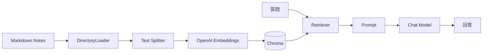
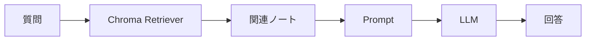
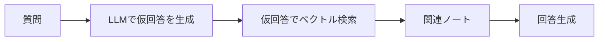
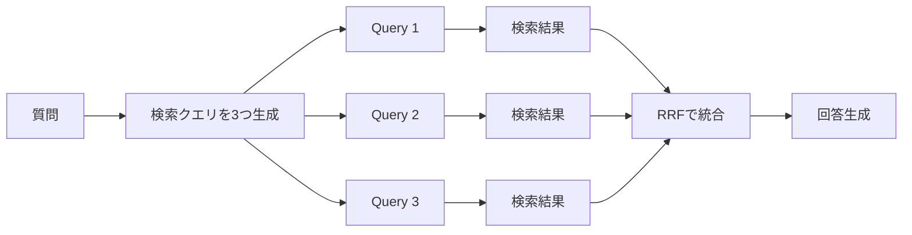
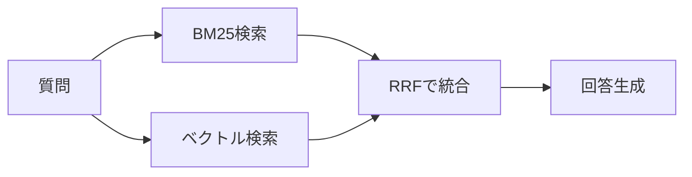
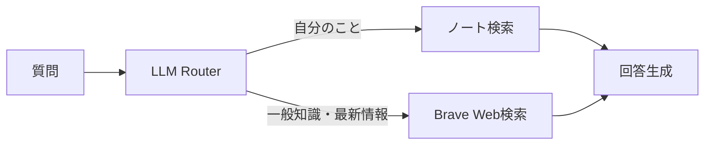
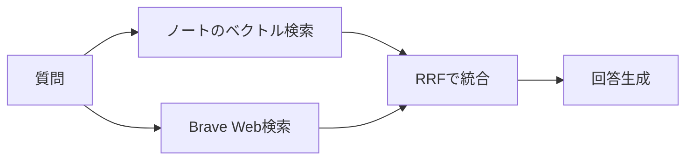

# LangChain RAG Notes

LangChainでローカルMarkdownノートを検索するRAG実装集です。

最初はシンプルなRAGから始めて、HyDE、Multi Query、RRF、BM25、Web検索との組み合わせまで段階的に試せます。

## 全体像



基本は、ローカルのMarkdownノートをチャンク化してChromaに入れ、質問に近いチャンクを検索してLLMに渡す流れです。

## セットアップ

```bash
uv sync
export OPENAI_API_KEY="..."
```

任意で利用するモデルを変更できます。

```bash
export OPENAI_CHAT_MODEL="gpt-4o-mini"
export OPENAI_EMBEDDING_MODEL="text-embedding-3-small"
```

Web検索を使う例では Brave Search API キーも必要です。

```bash
export BRAVE_SEARCH_API_KEY="..."
```

## 使い方

Markdownファイルが入ったディレクトリを指定して実行します。

```bash
uv run python examples/simple_notes_rag.py \
  --notes-dir /path/to/your/notes \
  --question "私の学びを教えて"
```

複数ディレクトリも指定できます。

```bash
uv run python examples/simple_notes_rag.py \
  --notes-dir /path/to/notes1 \
  --notes-dir /path/to/notes2 \
  --question "最近の関心を教えて"
```

## Examples

### 1. Simple RAG

```bash
uv run python examples/simple_notes_rag.py \
  --notes-dir /path/to/notes \
  --question "私の学びを教えて"
```

基本形です。



### 2. HyDE

```bash
uv run python examples/hyde.py \
  --notes-dir /path/to/notes \
  --question "私の学びを教えて"
```

質問から仮の回答文を生成し、その文章で検索します。
抽象的な質問を検索しやすい意味の塊に変換する手法です。



### 3. Multi Query + RRF

```bash
uv run python examples/multi_query.py \
  --notes-dir /path/to/notes \
  --question "私の学びを教えて"
```

質問から複数の検索クエリを生成し、それぞれの検索結果をRRFで統合します。



### 4. BM25 + Vector Hybrid

```bash
uv run python examples/hybrid_bm25_vector.py \
  --notes-dir /path/to/notes \
  --question "LangChainとRAGの学びを教えて"
```

古典的なキーワード検索であるBM25と、Embeddingによる意味検索を組み合わせます。



### 5. Router: Notes or Web

```bash
uv run python examples/router_notes_web.py \
  --notes-dir /path/to/notes \
  --question "LangChainの最新情報を教えて"
```

LLMが質問内容に応じて、ノート検索かWeb検索かを選びます。



### 6. Notes + Web Hybrid

```bash
uv run python examples/hybrid_notes_web.py \
  --notes-dir /path/to/notes \
  --question "最近のLangChainの情報も踏まえて、私の学びの方向性を考えて"
```

ノートの意味検索とBrave Web検索を両方実行し、RRFで統合します。



## 共通オプション

チャンクサイズは環境変数で変更できます。

```bash
export CHUNK_SIZE=500
export CHUNK_OVERLAP=100
```

## 注意

- `.env` や `.envrc` などAPIキーを含むファイルはコミットしないでください。
- Chromaの永続化DBには個人ノート由来の情報が含まれる可能性があります。公開repoには入れないでください。
